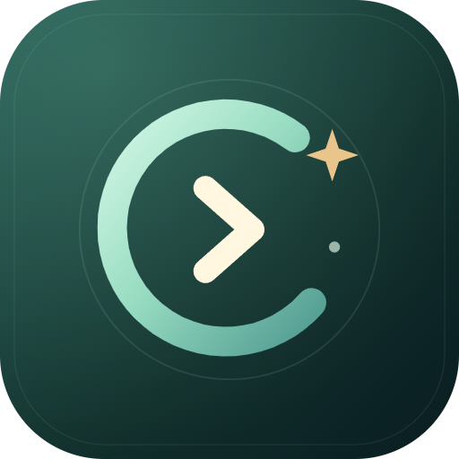
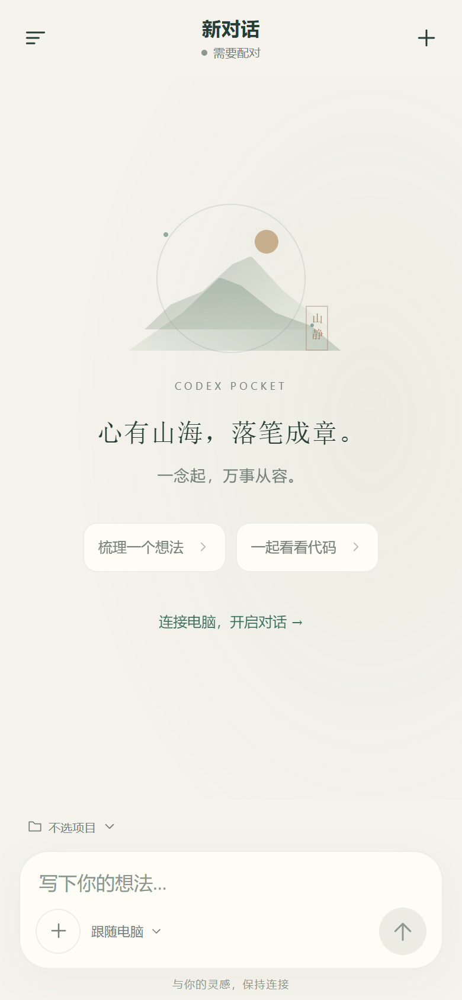
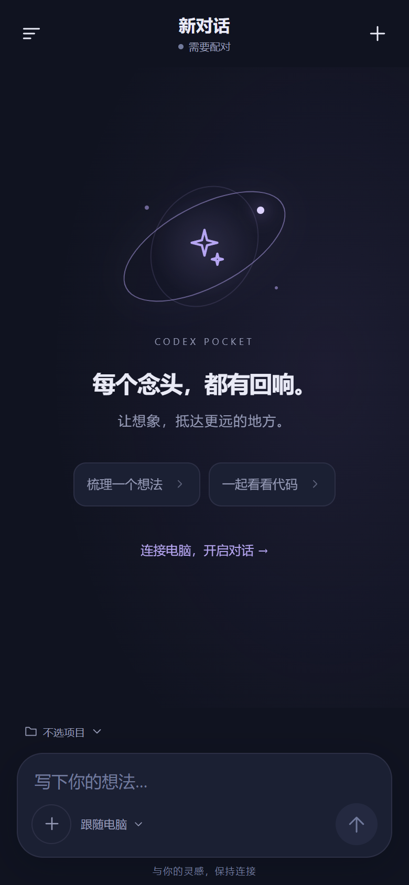
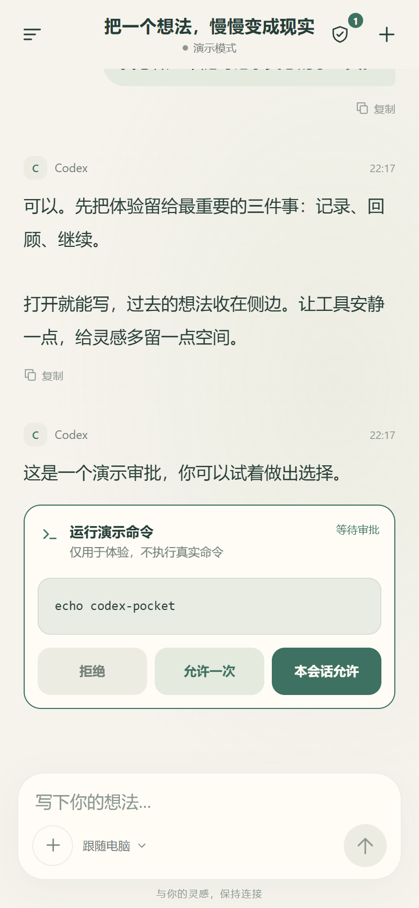
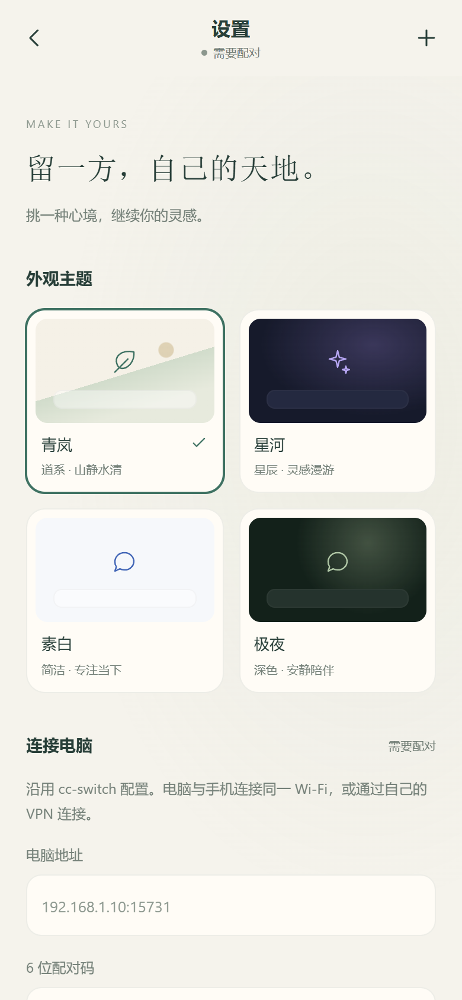

<div align="center">
  
  <h1>Codex Pocket</h1>
  <p><strong>Your desktop conversations, within reach.</strong></p>
  <p><a href="https://github.com/yunqing-yuan/codex-pocket/releases">Download</a> · <a href="README.md">中文</a></p>
</div>

An independent **Android app and Windows desktop bridge** for continuing Codex conversations from your phone. Send messages and attachments, select available models and reasoning levels, and respond to synchronized approvals in the same desktop conversation.

Pocket uses the model service already configured on your computer, including compatible providers configured through cc-switch. The phone needs neither a separate OpenAI sign-in nor your model API key. A working Codex desktop installation and valid provider configuration are still required. No accounts, API credits, or hosted relay service are supplied.

This is an unofficial community project, not affiliated with or endorsed by OpenAI. The current release is a personal-use preview.

<p align="center">
  
  
  
  
</p>

*Isolated renders of the app interface; conversations use built-in demo content. The current app UI is in Chinese.*

## Features

- A conversation-first interface with history and search in a side drawer.
- Messages in the same thread, handled by an existing desktop owner or the background engine.
- Synchronized command, file and permission approvals; task interruption.
- Up to 6 attachments per message, 20 MB each. Supported images become image inputs; documents are saved on the computer for its tools to read.
- Available models, reasoning levels and existing project folders read from the computer.
- Encrypted offline conversations and text drafts that survive app restarts, automatic reconnect, reply copying and four themes.
- Android Keystore credential storage and no built-in analytics service.

## Install

Requirements: **Android 8+**, **Windows**, **Node.js 20/22 LTS**, and a working Codex desktop configuration.

1. Download `Codex-Pocket.apk` and `Codex-Pocket-Bridge.zip` from [Releases](https://github.com/yunqing-yuan/codex-pocket/releases).
2. Install the APK on your phone. Extract the **whole bridge ZIP** into a writable folder on the computer.
3. Install [Node.js](https://nodejs.org/) and open Codex. Confirm your desktop model service works first.
4. Run `Start-Pocket.cmd`. A local pairing page displays the computer address and a six-digit code.
5. On the same trusted network, open the app drawer → settings (设置与配对), enter the address and code, and connect.

Keep the computer awake, signed in and the bridge running; the screen may be locked. The Codex desktop window can remain closed. After pairing, run `Enable-Background.cmd` to start the bridge automatically at Windows sign-in without opening chat or pairing windows. The hidden watcher restarts a bridge that exits. `Disable-Background.cmd` removes automatic startup and stops the watcher; the current bridge keeps running. Saved pairing does not expire on app restart or network loss. Only conversation content already loaded on the phone is available offline; sending and approvals need a connection. Unsent attachments are not persisted across app restarts. To share the app, distribute the APK and the complete bridge ZIP. Each user configures their own provider and computer. Never share an existing `runtime/` folder.

Version 1.3 adds chat archive/restore, hides structured reasoning items, and provides previews and Android sharing for files linked or modified within the conversation's project. HTML previews isolate content and disable external networking; complex modules and server-dependent sites may not work. Background turns release ownership on completion so the desktop can resume the same thread afterward. Existing desktop owners receive messages through IPC. Pocket never automatically opens or focuses a desktop chat; an already-open conversation may still display synchronized content, so lock your screen for privacy.

If connecting only works with Windows Firewall disabled, re-enable it, mark your own trusted Wi-Fi / phone hotspot as a **Private** network, and right-click `Fix-Firewall.cmd` → **Run as administrator**. The helper allows TCP 15731 only for the bridge's Node.js executable, Private networks and the local subnet. It reports existing Node.js block rules, which override allow rules. It does not change those blocks or create VPN rules. To remove its exception, run `Fix-Firewall.ps1 -Remove` from an elevated PowerShell.

## Privacy and transport

For different networks, run `Setup-Remote.cmd` from the updated bridge bundle. It guides Tailscale installation/sign-in, starts the bridge, configures an exception limited to its Tailscale interface/address and TCP 15731, and displays pairing details. Install Tailscale on Android and join the same private network. User sign-in and OS permission prompts are required. `Remove-Remote.cmd` removes only the helper's firewall rule. See [remote setup](docs/REMOTE.md); campus-network connectivity is not guaranteed or field-verified.

The phone communicates with your bridge, which communicates locally with Codex. Model keys remain in the computer's provider configuration. The app stores bridge credentials using Android Keystore and AES-GCM; app backup is disabled. Conversations and attachments sent to your model provider remain subject to that provider's policies.

The bridge listens on port `15731`; the pairing administration page is loopback-only on `127.0.0.1:15732`. **Default transport is HTTP, not encrypted. Use a trusted LAN or a private VPN; do not expose the bridge directly to the public internet.** A private VPN such as Tailscale can provide cross-network connectivity and must be configured separately.

The bridge stores its access token in `runtime/pairing.json` and attachments in `runtime/uploads/`. Attachments have no automatic retention limit. Disconnecting a phone does not revoke the server token; stop the bridge, remove its pairing file and restart to revoke all previously paired clients. These details and limitations are documented in [PRIVACY.md](PRIVACY.md) and [SECURITY.md](SECURITY.md).

## Compatibility

- Android 8 / API 26 minimum, with a working System WebView. No iOS package.
- Windows is the supported distribution path. Full macOS/Linux workflows are unverified.
- Development used Codex Windows `26.917.9434.0`. Same-thread sending uses an internal desktop IPC protocol that may change with desktop updates.
- The `1.3.2` APK uses debug signing and is a preview, not a store release.
- No claim of exhaustive device testing or an independent security audit. A user confirmed synchronization over mobile data through Tailscale; campus networks remain unverified.
- No built-in document parser, background push notifications, automatic public tunnel, or per-user access isolation.

## Build

The bridge only uses Node.js built-ins; run `node desktop.mjs` without installing npm dependencies.

For Android, install JDK 17 and Android SDK 34, configure `JAVA_HOME` and `ANDROID_HOME`, then:

```powershell
npm ci
npm run build
npx cap sync android
.\android\gradlew.bat -p android :app:assembleDebug
```

Output: `android/app/build/outputs/apk/debug/app-debug.apk`. A locally generated signing key may prevent installing over the published APK. Uninstalling clears app data; use your own securely stored signing key for a production release.

See [development notes](docs/DEVELOPMENT.md), [setup and troubleshooting](docs/SETUP.md), [contributing](CONTRIBUTING.md) and [release notes](CHANGELOG.md). These detailed guides are currently in Chinese. Use [private vulnerability reporting](https://github.com/yunqing-yuan/codex-pocket/security/advisories/new) for security issues.

## License

Original source and artwork: [MIT](LICENSE). Dependencies retain their own licenses; see [third-party notices](THIRD_PARTY_NOTICES.md). Codex desktop, cc-switch, Node.js, provider credentials and personal runtime data are not redistributed.
