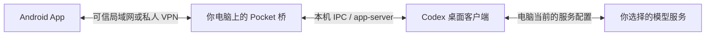

<div align="center">
  
  <h1>Codex Pocket</h1>
  <p><strong>电脑在工作，手机随时接上。</strong></p>
  <p>让对话、附件与审批，装进你的口袋。</p>
  <p><a href="https://github.com/yunqing-yuan/codex-pocket/releases">下载 Android App / 电脑桥</a> · <a href="docs/SETUP.md">安装与排障</a> · <a href="README.en.md">English</a></p>
  <p>   </p>
</div>

Codex Pocket 是一个独立开发的 **Android 手机 App + Windows 电脑桥**。在手机上继续电脑里的 Codex 对话，发送文字和附件，选择模型与推理强度，处理已同步的操作审批。

手机通过你自己的电脑工作，沿用电脑上已配置的 Codex 模型服务，包括通过 cc-switch 配置的兼容中转服务。**手机端无需另行登录 OpenAI 账户，也无需填写模型 API Key**；电脑端仍需有可正常使用的 Codex 配置和服务凭据。本项目不提供中转服务、额度或共享账号。

这是非官方社区项目，与 OpenAI 无隶属或背书关系。当前为个人使用预览版，手机以可安装的 APK 交付。

## 一眼看见

<p align="center">
  
  
  
  
</p>

*以上是 App 界面的独立渲染，聊天内容来自内置演示，不含真实账号、对话或配对信息。*

## 可以做什么

| 能力 | 使用方式 |
| --- | --- |
| 接着聊 | 首页直接对话，左上角展开记录、搜索标题，底部进入设置与配对 |
| 两端同一条对话 | 手机将消息交给电脑窗口处理；保留同一会话，不额外复制对话 |
| 远程审批 | 查看已同步的命令、文件修改、权限请求，批准或拒绝；可请求停止任务 |
| 上传附件 | 每条消息最多 6 个文件、每个 20 MB；常见图片作为图片输入，文档保存到电脑供工具读取 |
| 选择模型 | 从电脑读取可用模型和支持的推理强度，能力以当前服务为准 |
| 选择项目 | 新对话可选电脑上已有项目，或在桥的独立工作目录创建 |
| 舒适输入 | 键盘避让、会话内草稿、回复复制、发送失败保留内容 |
| 四种主题 | 青岚、星河、素白、极夜 |
| 归档与恢复 | 在侧边历史归档会话，在「已归档」中查看、恢复 |
| 作品预览 | 对话「⋯ → 查看作品」预览项目内图片、HTML、文本和媒体，分享原文件 |
| 后台执行 | Windows 登录后自动启动，后台进程退出时自动恢复，无需打开 Codex 窗口 |
| 打开即用 | 一次配对后自动连接，回到 App 或恢复网络后自动重连 |
| 离线查看 | 已同步到手机的聊天、当前对话和文字草稿加密保存，关闭 App 后仍保留 |
| 跨网络 | 双击 `Setup-Remote.cmd` 配置 Tailscale 私人网络；手机首次安装 Tailscale 并登录 |

文档上传不等于内置 Office/PDF 解析；能否读取具体格式由电脑端工具决定。后台消息推送、iOS 安装包、多用户权限隔离目前未提供。

## 五分钟上手

需要：**Android 8.0+**、**Windows 电脑**、**Node.js 20/22 LTS**，以及已能正常对话的 Codex 桌面客户端。

1. 打开 [Releases](https://github.com/yunqing-yuan/codex-pocket/releases)，下载 `Codex-Pocket.apk` 和 `Codex-Pocket-Bridge.zip`。
2. 手机安装 APK；电脑把桥压缩包完整解压到一个有写入权限的目录。
3. 电脑安装 [Node.js](https://nodejs.org/)，打开 Codex。使用 cc-switch 时，先确认它切换后的模型在电脑上能正常回复。
4. 双击 `Start-Pocket.cmd`。电脑会打开配对页，显示地址和六位配对码。完成配置后，日常使用不必打开 Codex 桌面窗口。
5. 手机与电脑连接同一可信网络，在 App 的「设置与配对」填写地址和配对码，点击连接。

电脑需保持开机、登录且桥运行，可以锁屏。首次配对后运行 `Enable-Background.cmd`，即可在 Windows 登录后自动启动隐藏的桥，不弹出配对页或 Codex 窗口。`Disable-Background.cmd` 可撤销自动启动。防火墙工具仅用于网络排障，不是应用兼容性前置条件。

若「防火墙关了能连、开了不行」，将自己的可信 Wi-Fi / 手机热点设为 Windows **专用网络**，再右键新版电脑桥中的 `Fix-Firewall.cmd` 以管理员身份运行。它仅放行电脑桥的本地子网端口，详见 [防火墙排障](docs/SETUP.md#开启防火墙后无法连接)。

**分享给朋友时：发送 APK + 完整电脑桥 ZIP。仅发启动脚本不够。** 每个人在自己的电脑配置自己的模型服务，启动后生成自己的配对信息；不要转发你已使用过的 `runtime/` 目录。

更多步骤见 [安装与排障](docs/SETUP.md)，数据存储见 [隐私说明](PRIVACY.md)。

**手机和电脑不在同一网络？** 下载包含 `Setup-Remote.cmd` 的电脑桥，双击运行配置向导；手机安装 Tailscale，登录同一私人网络，按向导填写地址和配对码。首次登录与系统权限仍需本人操作，见 [异地连接指南](docs/REMOTE.md)。校园网是否可用取决于其网络策略，尚未做用户校园网实测。

## 数据如何流转



- API Key 留在电脑已有配置中，App 保存用于连接桥的配对凭据。
- Android 使用 Keystore + AES-GCM 保存配对信息，并关闭应用备份。
- 桥默认监听 `15731`，配对管理页仅监听本机 `127.0.0.1:15732`。
- 六位配对码有效期 10 分钟，成功配对后更新；已有设备通过访问令牌连接。
- 默认桥连接使用 **HTTP**。令牌校验不等于传输加密，请使用可信局域网或私人 VPN，**不要直接把端口暴露到公网**。

本项目没有自建云端中转或分析上报服务。你选择的模型供应商仍会按其政策处理任务内容，详情见 [隐私说明](PRIVACY.md) 和 [安全说明](SECURITY.md)。

## 兼容性与当前限制

| 项目 | 当前状态 |
| --- | --- |
| Android | 最低 Android 8 / API 26，需可用的 Android System WebView；未覆盖全部机型 |
| 电脑 | Windows 为当前交付路径；macOS / Linux 未验证完整流程 |
| 桌面集成 | 开发时使用 Codex Windows `26.917.9434.0`；同会话发送依赖内部 IPC，桌面更新可能影响兼容性 |
| APK | `1.3.3`，versionCode `9`，debug 签名的预览包；不是应用商店正式发行版 |
| 推理与审批 | 取决于电脑版本、模型服务、会话状态和可同步的审批类型 |
| 远程网络 | 通过向导配置 Tailscale；已有用户确认手机移动数据下同步成功，校园网仍需实际验证 |
| 多设备 | 共用电脑桥权限，无独立账号或单设备令牌吊销；适合个人自用 |

已有桌面所有者时转发给该窗口，否则由后台引擎处理同一条会话。后台活跃任务需本轮完成后才能由桌面接管。桥不会自动打开或聚焦桌面会话，但已经打开的窗口仍可能显示同步内容，外出时建议锁屏。

HTML 预览支持项目内常见 CSS、脚本和图片，禁止外网资源；复杂模块或服务端功能需在电脑运行。作品列表只取回复链接或文件修改记录明确引用的项目内文件。结构化思考内容默认隐藏。

这个项目已有构建产物；不声称经过完整的设备兼容测试或安全审计。

## 从源码构建

运行电脑桥只用 Node.js 内置模块，**不需要 `npm install`**：

```powershell
node desktop.mjs
```

构建 Android 需要 Node.js、JDK 17、Android SDK 34，并设置本机 `JAVA_HOME` / `ANDROID_HOME`：

```powershell
npm ci
npm run build
npx cap sync android
.\android\gradlew.bat -p android :app:assembleDebug
```

APK 输出：`android/app/build/outputs/apk/debug/app-debug.apk`。自编译包与发布包可能使用不同签名，无法直接覆盖安装；卸载会清除配对等本机数据。自行发布正式版本时，请使用自己妥善保管的签名密钥。

`npm run dev` 仅用于开发界面预览；日常使用安装 Android App。开发脚本和其他环境变量见 [开发说明](docs/DEVELOPMENT.md)。

## 项目结构

```text
www/                      手机界面、主题与交互
android/                  Android 工程及原生凭据 / 输入适配
bridge.mjs                Codex app-server 适配与认证 HTTP API
bridge/desktop-ipc.mjs     同会话发送、状态和审批的桌面 IPC 适配
bridge/uploads.mjs        附件保存与输入转换
desktop.mjs               电脑桥入口和本机配对页
Start-Pocket.*             Windows 启动入口
Restart-Pocket.*           检查状态后重启电脑桥
resources/                图标与图标生成脚本
docs/                     安装、开发和开源许可说明
```

## 反馈与贡献

欢迎在 [Issues](https://github.com/yunqing-yuan/codex-pocket/issues) 提交可复现的问题。说明 App 版本、Android 版本、Codex 桌面版本与复现步骤；截图和日志请先移除路径、对话、令牌与服务密钥。参见 [贡献指南](CONTRIBUTING.md)。安全问题请使用 [私密漏洞报告](https://github.com/yunqing-yuan/codex-pocket/security/advisories/new)。

## 许可证

项目原创代码与图标采用 [MIT](LICENSE)。第三方组件遵循各自许可，见 [第三方声明](THIRD_PARTY_NOTICES.md)。Codex 桌面客户端、cc-switch、Node.js 和模型服务需自行获取；本仓库及电脑桥包不包含这些产品的程序或用户配置。
